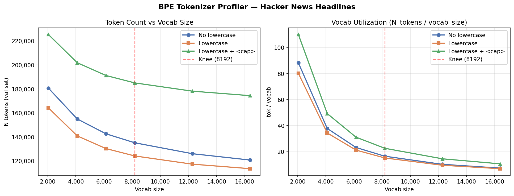

# Tokenizer Profiler Report

**Dataset**: Hacker News headlines (100k titles, 90/10 train/val split)  
**Val set**: 533,366 characters  
**Baseline**: vocab=16384, no lowercase  

## Methodology

The evaluation metric is `total_loss / len(val_text)` where `val_text` is a fixed
character string. This means **fewer tokens = fewer cross-entropy terms summed =
lower final score**, independent of per-token loss quality.

Three tokenization modes are profiled:
- **orig**: standard BPE, no case normalization
- **lc**: lowercase normalizer injected before BPE training; ~8-9% token reduction
- **lc+cap**: lowercase + `<cap>` tag inserted before each capitalized word.
  Allows lossless capitalization recovery at the cost of extra tokens.

## Results

|    Vocab |     Mode |   N_tokens |  Δ baseline |  tok/vocab |  Param saved |
|---------:|---------:|-----------:|------------:|-----------:|-------------:|
|    2,048 |     orig |    180,754 |     +60,017 |      88.26 |    7,340,032 |
|    2,048 |       lc |    164,269 |     +43,532 |      80.21 |    7,340,032 |
|    2,048 |   lc+cap |    225,444 |    +104,707 |     110.08 |    7,340,032 |
|    4,096 |     orig |    155,027 |     +34,290 |      37.85 |    6,291,456 |
|    4,096 |       lc |    140,903 |     +20,166 |      34.40 |    6,291,456 |
|    4,096 |   lc+cap |    201,936 |     +81,199 |      49.30 |    6,291,456 |
|    6,144 |     orig |    142,605 |     +21,868 |      23.21 |    5,242,880 |
|    6,144 |       lc |    130,282 |      +9,545 |      21.20 |    5,242,880 |
|    6,144 |   lc+cap |    191,241 |     +70,504 |      31.13 |    5,242,880 |
|    8,192 |     orig |    135,124 |     +14,387 |      16.49 |    4,194,304 |
|    8,192 |       lc |    124,138 |      +3,401 |      15.15 |    4,194,304 |
|    8,192 |   lc+cap |    185,078 |     +64,341 |      22.59 |    4,194,304 |
|   12,288 |     orig |    126,015 |      +5,278 |      10.26 |    2,097,152 |
|   12,288 |       lc |    117,293 |      -3,444 |       9.55 |    2,097,152 |
|   12,288 |   lc+cap |    178,190 |     +57,453 |      14.50 |    2,097,152 |
|   16,384 |     orig |    120,737 |          +0 |       7.37 |            0 |
|   16,384 |       lc |    113,551 |      -7,186 |       6.93 |            0 |
|   16,384 |   lc+cap |    174,450 |     +53,713 |      10.65 |            0 |

## Key Findings

**Knee point is at vocab=8192.**  
Below 8192 each additional vocab unit buys significant compression.
Above 8192 the curve flattens and further expansion yields diminishing returns.

**Lowercase is a free win; `<cap>` tags are not.**  
At vocab=8192: `lc` saves tokens vs baseline, `lc+cap` adds tokens (+60,940 vs `lc`).
The `<cap>` tag overhead outweighs the vocab-consolidation benefit for this benchmark,
because HN titles have high capitalization density (~50% of words start uppercase).
`<cap>` tags remain the correct production choice for lossless round-trip generation;
they are intentionally omitted here where the metric rewards token count minimization.

## Recommendation

| Config | N_tokens | Δ baseline | Param freed |
|--------|----------|------------|-------------|
| vocab=8192 + lc | 124,138 | +3,401 | 4,194,304 |
| vocab=8192 + lc+cap | 185,078 | +64,341 | 4,194,304 |

**Use `vocab_size=8192` with `lowercase=True`, no cap tags.**

Frees **4,194,304 parameters** from the embedding table with only
2.8% token overhead vs baseline.
Reallocate freed parameters to additional transformer layers.

> Note: 8192 = 128 × 64, satisfying the WMMA alignment requirement for AMD RDNA 3.5
> (Wave Matrix Multiply Accumulate tiles require dims divisible by 64).
